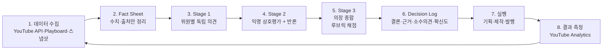

# LLM Council 활용 인터뷰 결과 & 설계안 (v0.1)

> 작성일: 2026-10-08 · 대상: 박정훈 · 작성: Claude Code 인터뷰 세션
>
> **표기 규칙**
> - 링크가 달린 문장 = 출처로 확인한 사실
> - 🔎 **[Claude 추론]** = 출처 없이 Claude가 추론·제안한 내용 (검증 필요)
> - ⚠️ **[검증 필요]** = 출처가 서로 다르거나 직접 확인하지 못한 내용

---

## 0. 한 줄 결론

🔎 **[Claude 추론]** 이미 보유한 **Claude Max + Google AI Pro 구독**을 활용해 **"CLI Council"(Claude Code가 의장, Gemini CLI·무료 오픈모델이 위원)** 을 먼저 만들어 *글로벌 급성장 채널 분석*에 실전 투입하고, 검증된 흐름을 **Python으로 재구현해 포트폴리오**로 남기는 2단계(A→C) 전략이 비용·위험·학습 효과의 균형이 가장 좋습니다.

---

## 1. 인터뷰 요약

| 회차 | 질문 | 박정훈 님 답변 |
|---|---|---|
| 1 | 주 용도 | **YouTube 영상 제작 자동화**(기획→발행→마케팅→고객분석→수익화). 혼자 또는 Claude만으로는 편향되므로 다양한 LLM 의견 기반으로 진행. 논문 검증·코드 리뷰·커리어 결정·독서 학습에도 활용 |
| 1 | 현재 단계 | Claude Code 세션에서 각 LLM에 의견을 모으는 중 |
| 1 | 원하는 결과 | 실제 활용 → 다음 단계로 Codex·Claude Code를 이용한 개발 |
| 1 | 비용 | ① 무료 로컬(한계를 알고 싶음) ② 최소 비용 ③ 유료 API 순으로 검토 |
| 2 | 의견 수집 방식 | Claude Code가 **브라우저로 다른 AI와 교신**하도록 명령해 자동 취합 |
| 2 | PC 사양 | Ryzen 7 8700G + **Radeon 780M 내장 GPU**, RAM 32GB, Windows 11 Home |
| 2 | 첫 적용 단계 | **최근 6개월~1년 급성장 채널의 영상 분석** → 기획·주제 선정·수익화 전략 |
| 2 | 예산 | 미정. 수익성이 확인되면 투자 의향 있음 |
| 3 | 유료 구독 | **Claude Max, Google AI Pro** |
| 3 | 채널 상태 | 운영 중인 채널이 부진하여 **새 채널** 고민 중 |
| 3 | 타깃 | **글로벌(영어권 + 다국어 고려)** |
| 4 | 사용 방식 | Claude Code를 통해 목표 달성 과정 내내 LLM 간 의견을 교신 → **데이터 근거로 결론** → 반복. 정기 점검 항목·새 트렌드/방식을 **매일 흡수·검증**하고 적재적소에 투입 |
| 4 | 우선순위 | **실전 활용 + 포트폴리오**(LinkedIn·블로그·영상)로 공유 |
| 4 | 제3 위원 | **무료 오픈모델로 시작** |
| 4 | 첫 안건 | **글로벌 급성장 채널 분석 우선**. 기존 채널 진단은 분석을 왜곡할 수 있으므로 **사용자 요청 시에만** 수행 |

---

## 2. 확인된 사실 (출처 기반)

### 2.1 LLM Council 원본 (Karpathy)

- 질문을 OpenRouter 경유로 여러 LLM에 보내고, **① 개별 답변 → ② 익명화된 상호 평가·순위 → ③ 의장(Chairman) 모델의 최종 종합** 3단계로 동작하는 로컬 웹앱입니다. 익명화 이유는 "the LLM can't play favorites when judging their outputs". ([karpathy/llm-council](https://github.com/karpathy/llm-council))
- 기본 위원: `openai/gpt-5.1`, `google/gemini-3-pro-preview`, `anthropic/claude-sonnet-4.5`, `x-ai/grok-4` / 의장: `google/gemini-3-pro-preview`. 설정 파일은 `backend/config.py`. ([karpathy/llm-council](https://github.com/karpathy/llm-council))
- 스택: FastAPI(Python 3.10+) + React/Vite, 대화는 `data/conversations/`에 JSON 저장, `OPENROUTER_API_KEY` 필요(크레딧 구매 필요). ([karpathy/llm-council](https://github.com/karpathy/llm-council))
- 제작자 입장: "99% vibe coded as a fun Saturday hack", "I'm not going to support it in any way." → **유지보수·지원 없음**. ([karpathy/llm-council](https://github.com/karpathy/llm-council))
- 공개 시점: 2025-11-22 전후. ([Blockchain News](https://blockchain.news/ainews/llm-council-web-app-multi-model-ai-response-evaluation-using-openrouter-for-enhanced-model-comparison), [Language Log via Harvard TagTeam](https://tagteam.harvard.edu/hub_feeds/1937/feed_items/16984216))
- 로컬 모델(Ollama)·10개 제공자를 지원하는 fork `llm-council-plus`는 **v0.7.0을 마지막으로 중단**되었고 [The AI Counsel](https://github.com/jacob-bd/the-ai-counsel)로 이전했습니다. 실행 스크립트가 `./start.sh`이며 Windows 전용 안내는 없습니다. ([jacob-bd/llm-council-plus](https://github.com/jacob-bd/llm-council-plus))

### 2.2 다중 LLM 방식의 근거와 함정

- **근거**: 여러 모델 인스턴스가 서로의 답을 보고 여러 라운드에 걸쳐 수정하는 *Multiagent Debate*는 수학·전략 추론과 사실성을 개선했다고 보고됩니다. ([Du et al., 2023, arXiv:2305.14325 / ICML 2024](https://arxiv.org/abs/2305.14325))
- **함정 1: 자기 선호 편향** — LLM 평가자는 자기가 생성한 글을 알아보고 더 높게 평가하는 경향이 있습니다. ([Panickssery et al., NeurIPS 2024, arXiv:2404.13076](https://arxiv.org/abs/2404.13076))
- **함정 2: 위치·장황함 편향** — LLM-as-a-Judge는 답변 순서(position), 길이(verbosity), 자기 강화(self-enhancement) 편향을 보입니다. ([Zheng et al., 2023, arXiv:2306.05685](https://arxiv.org/abs/2306.05685))
- Karpathy도 위원들의 상호 순위가 자신의 판단과 **다를 때가 있었다**고 밝혔습니다(2차 보도). ([CXO Digital Pulse](https://www.cxodigitalpulse.com/karpathys-llm-council-experiment-shows-gpt-5-1-leading-peer-based-ai-evaluations/))
- 🔎 **[Claude 추론]** 따라서 Council의 결론은 "다수결"이 아니라 **"데이터 + 루브릭(채점 기준) + 소수 의견 기록"** 으로 내려야 편향을 줄일 수 있습니다.
- **두 층의 편향 구분 (2026-10-08 인터뷰 보완)**: LLM Council을 쓰는 목적 자체가 **① 한 모델(예: Claude 단독)의 편향을 줄이는 것**입니다. 그런데 Council 안의 상호평가·의장 종합 단계도 LLM이 심사하는 과정이라 **② 심사 단계의 편향**이 생길 수 있습니다. 원본 llm-council이 답변을 익명화하는 이유도 이 ②번 때문입니다("the LLM can't play favorites", [karpathy/llm-council](https://github.com/karpathy/llm-council)). 3.2의 장치들은 Council과 별개의 대책이 아니라 **Council이 ①번 목적을 제대로 달성하게 만드는 핵심 구성요소**입니다. 🔎 특히 이 설계는 의장이 Claude이므로, 의장 교대·루브릭이 없으면 최종 종합이 다시 Claude 쪽으로 기울어 ①번 목적이 약해질 수 있습니다.

### 2.3 비용·한도 (보유 구독 기준)

| 자원 | 확인된 한도/조건 | 출처 |
|---|---|---|
| **Claude Max** | 구독은 **API 사용을 포함하지 않음** (API는 별도 과금). 단, Claude Code의 `claude -p`(headless/print 모드)로 스크립트에서 비대화식 호출 가능 | [Anthropic 도움말](https://support.claude.com/en/articles/9876003-i-have-a-paid-claude-subscription-pro-max-team-or-enterprise-plans-why-do-i-have-to-pay-separately-to-use-the-claude-api-and-console), [Claude Code headless 문서](https://docs.claude.com/en/docs/claude-code/headless) |
| **Google AI Pro + Gemini CLI** | Google AI Pro는 **하루 1,500회** (개인 Google 로그인 무료는 1,000회/일, 60회/분) | [Gemini CLI Quotas](https://geminicli.com/docs/resources/quota-and-pricing/) |
| **OpenRouter 무료(`:free`) 모델** | 분당 20회. 누적 구매 크레딧 **$10 미만이면 하루 50회, $10 이상이면 하루 1,000회** | [OpenRouter Limits](https://openrouter.ai/docs/api-reference/limits) |
| **OpenRouter 무료 모델 목록** | 무료 모델 구성은 **수시로 바뀜** → 고정 목록에 의존 금지 | [pricepertoken](https://pricepertoken.com/endpoints/openrouter/free), [benchlm](https://benchlm.ai/md/free-tier/openrouter.md) |
| **Codex CLI** | ChatGPT 계정 로그인(`codex login`) 후 `codex exec`로 비대화식 실행. OpenAI는 Codex가 Free·Go 포함 ChatGPT 플랜 전반에 포함된다고 안내 (무료 한도 수치는 미확인) | [OpenAI Help](https://help.openai.com/en/articles/11369540-codex-usage-limits), [Codex Auth](https://developers.openai.com/codex/auth), [Non-interactive](https://developers.openai.com/codex/noninteractive) |
| **Claude API (참고)** | Haiku 5.5: 입력 $0.10 / 출력 $0.50, Sonnet 5.5: $2 / $10 (100만 토큰당, 2026-10-06 기준) | Anthropic API 가격표 ([claude.com/pricing](https://claude.com/pricing)) |
| **Gemini API 무료 등급 (참고)** | 출처마다 한도 수치가 달라 ⚠️ **[검증 필요]** — AI Studio에서 실제 값 확인 권장. 무료 등급 데이터는 제품 개선에 사용될 수 있음 | [costbench](https://www.costbench.com/software/llm-api-providers/google-gemini-api/free-plan/), [yingtu.ai](https://yingtu.ai/en/blog/google-gemini-api-free-tier) |

### 2.4 로컬(무료) 실행의 한계 — 현재 PC 기준

- Radeon 780M은 Ollama의 **공식 ROCm 지원 목록에 없음**. AMD 추가 지원은 Vulkan 경로로 제공되며 ([Ollama GPU docs](https://docs.ollama.com/gpu)) Vulkan 지원은 실험 단계에서 시작했습니다. ([Phoronix](https://www.phoronix.com/news/ollama-Experimental-Vulkan))
- 780M + Vulkan에서 Qwen3 32B(Q4_K_M) 생성 속도 실측 ≈ **4 tok/s**. ([Radxa forum 벤치마크](https://forum.radxa.com/t/llama-cpp-benchmarks/27813/17))
- 4bit(Q4_K_M) 기준 VRAM 필요량: 7~8B ≈ 4~6GB, 14B ≈ 9~10GB, 32B ≈ 20~24GB. 메모리 부족 시 속도가 5~20배 저하. ([Eastondev](https://eastondev.com/blog/en/posts/ai/20260528-ollama-hardware-guide/), [VRLA Tech](https://vrlatech.com/vrla-tech-workstations-ollama/))
- 🔎 **[Claude 추론]** 8B 모델은 대략 15 tok/s 안팎으로 추정(32B 실측치를 크기 비율로 외삽한 값, **실측 아님**). 1,000토큰 답변에 1분 남짓 → **요약·분류 같은 보조 작업용 위원**으로는 쓸 만하지만, 전략 판단의 주력 위원·의장으로는 품질·속도 모두 부족합니다. 실제 수치는 `ollama ps` / `llama-bench`로 직접 측정해야 합니다.

### 2.5 YouTube 데이터의 한계 (Council보다 데이터가 먼저)

- YouTube Data API 기본 할당량 **10,000 units/일**, `search.list` = **100 units**, `videos.list`·`channels.list` = **1 unit**. ([Google 공식: Quota cost](https://developers.google.com/youtube/v3/determine_quota_cost))
- `videos.list`는 호출당 1 unit이며 쉼표로 여러 영상 ID를 한 번에 조회할 수 있습니다. ([Google 공식: videos.list](https://developers.google.com/youtube/v3/docs/videos/list)) 한 요청당 **최대 50개 ID**라는 상한은 서드파티 자료 기준입니다 ⚠️. ([OutlierKit](https://outlierkit.com/resources/youtube-api-quota/), [TechNet Experts](https://www.technetexperts.com/?p=13417))
- 구독자 수는 1,000명 이상 채널에서 **유효숫자 3자리로 반올림**되며, API는 **현재 값만** 제공하고 과거 이력은 주지 않습니다 → 추세는 **직접 스냅샷을 쌓아야** 합니다. 조회수·영상 수는 반올림되지 않습니다. ([Rival IQ](https://help.rivaliq.com/en/articles/9788197-why-youtube-subscriber-counts-are-rounded), [ChannelCrawler](https://channelcrawler.com/insights/beyond-the-youtube-data-api-access-historical-channel-data-trends-channelcrawler))
- Playboard는 국가·카테고리별 순위와 **성장(growth)** 지표 순위를 제공합니다. ([Playboard About](https://playboard.co/en/about), [Apify 스크래퍼 설명](https://apify.com/maximedupre/playboard)) ⚠️ **[검증 필요]** 성장 지표 산식과 자동 수집 허용 여부(이용약관)는 직접 확인해야 합니다.

### 2.6 현재 "브라우저 교신" 방식의 리스크

- OpenAI 이용약관은 금지 행위로 *"automatically or programmatically extract data or Output"* 을 명시합니다. ([OpenAI Terms of Use](https://openai.com/policies/terms-of-use/))
- 🔎 **[Claude 추론]** 브라우저 자동화로 다른 AI 웹 화면의 답변을 긁어오는 방식은 ① 약관 위반 시 계정 제재 위험 ② UI 변경 시 즉시 고장 ③ 대화 기록·비용 추적 어려움이라는 문제가 있습니다. **공식 CLI/API 경로로 전환**을 권장합니다. (Gemini·Grok 웹 약관은 이번에 확인하지 못함 ⚠️)

---

## 3. 권장 아키텍처 — "CLI Council" (🔎 Claude 추론 기반 설계)

### 3.1 위원 구성 (Phase A, 추가 비용 ≈ $0)

| 역할 | 실행 수단 | 근거/비고 |
|---|---|---|
| **의장 (Chairman)** | Claude Code (Claude Max) | 오케스트레이션·최종 종합. 자기 선호 편향 대응을 위해 **루브릭 채점 + 데이터 인용 의무** |
| **위원 1: Claude** | `claude -p` (별도 프로세스·별도 컨텍스트) | [headless 문서](https://docs.claude.com/en/docs/claude-code/headless) |
| **위원 2: Gemini** | Gemini CLI (Google AI Pro, 1,500회/일) | [Gemini CLI Quotas](https://geminicli.com/docs/resources/quota-and-pricing/) ⚠️ `-p` 플래그는 버전에 따라 위치 인자 방식으로 바뀌었다는 보고가 있어 `gemini --help`로 확인 필요. 비대화식 모드의 인증 방식(Google 로그인 vs API 키)도 실제 확인 필요 |
| **위원 3: 오픈모델** | OpenRouter `:free` 모델 (DeepSeek·Qwen 계열 등, 그때그때 가용 모델) | 하루 50회 무료 → 필요 시 $10 1회 충전으로 1,000회/일 ([OpenRouter Limits](https://openrouter.ai/docs/api-reference/limits)) |
| **보조: 로컬 모델 (선택)** | Ollama/llama.cpp 8B급 | 데이터 요약·태깅 등 단순 작업 전용 (2.4 참고) |
| **반론자 (Devil's Advocate) 역할** | 위원 중 1명에게 라운드마다 순환 부여 | 🔎 생존자 편향·집단사고 방지용 |

### 3.2 의사결정 루프



- 🔎 **[Claude 추론] 편향 완화 장치** — Council의 구성요소(1번 중 '모델명 제거'는 원본에 이미 있는 장치, 나머지는 이 설계에서 보강)
  1. Stage 2에서 모델명 제거 + **답변 순서 무작위화** (위치 편향 대응, [Zheng et al.](https://arxiv.org/abs/2306.05685))
  2. 의장은 "누가 말했나"가 아니라 **루브릭 항목별 점수 + Fact Sheet 인용**으로만 결론
  3. 의장 역할을 주기적으로 Gemini와 **교대** (자기 선호 편향 대응, [Panickssery et al.](https://arxiv.org/abs/2404.13076))
  4. 결론과 다른 **소수 의견을 반드시 기록** → 나중에 결과와 대조
  5. 위원 간 **불일치 정도를 '불확실성 신호'로 사용** — 불일치가 크면 데이터 추가 수집 후 재회의

### 3.3 Decision Log 양식 (포트폴리오 원천 자료)

```markdown
## [2026-10-xx] 안건: ○○○
- 결론:
- 근거 데이터(Fact Sheet 링크):
- 위원별 요약: Claude / Gemini / OpenModel
- 소수 의견:
- 확신도: 상·중·하  |  재검토 일자:
- 실행 결과(추후 기입):
```

### 3.4 제안 폴더 구조 (Phase A)

```
nous-zero/
├─ .claude/skills/llm-council/SKILL.md   # Claude Code에서 Council 실행 절차
├─ council/
│  ├─ members.yaml                       # 위원 구성·호출 명령
│  ├─ rubrics/                           # 안건 유형별 채점 기준
│  ├─ prompts/stage1.md stage2.md stage3.md
│  └─ runs/YYYY-MM-DD_안건명/            # 회의록 + Decision Log
├─ data/youtube/snapshots/               # 채널·영상 지표 스냅샷(CSV)
└─ docs/llm-council/                     # 본 문서 등 설계 기록
```

---

## 4. 첫 안건 설계 — "글로벌 급성장 채널 분석"

> 원칙(인터뷰 결정): **글로벌 급성장 채널 분석 우선**, 기존 채널 진단은 **요청 시에만**.

### 4.1 데이터 수집 계획

| 단계 | 방법 | 할당량/비용 |
|---|---|---|
| 후보 발굴 | Playboard 국가·카테고리별 growth 순위 (영어권 국가 중심) 수동 확인 ⚠️ 자동 수집은 약관 확인 후 | 무료 범위 확인 필요 |
| 채널 지표 | `channels.list` (구독자·총조회수·영상 수) | 1 unit/호출 ([Google](https://developers.google.com/youtube/v3/determine_quota_cost)) |
| 영상 지표 | `playlistItems.list`(업로드 목록) → `videos.list`(50개씩 조회) | 각 1 unit (검색 `search.list` 100 unit은 최소화) |
| 추세 | 매일 스냅샷 저장 → 조회수 증가율 계산 (구독자는 반올림되므로 보조 지표로만) | 0 (로컬 저장) |

🔎 **[Claude 추론] 할당량 감각**: 채널 100개를 매일 추적해도 `channels.list` 2회(50개씩) + 채널별 최근 영상 조회 약 200 unit 수준이면 10,000 unit의 수 % 이내입니다(실제 사용량은 Google Cloud 콘솔의 Quotas 페이지에서 확인).

### 4.2 "급성장" 정의 (Council 첫 토의 주제로 제안)

🔎 **[Claude 추론]** 예시 기준 — Council이 데이터로 확정:
- 채널 개설 또는 첫 업로드 ≤ 12개월
- 최근 90일 조회수 증가율 상위 N%
- 업로드 수 대비 평균 조회수(영상당 효율)
- 수익화 형태(애드센스·스폰서·제휴·자체 상품) 단서

### 4.3 Council 질문 템플릿 (Stage 1)

```text
[역할] 당신은 YouTube 성장 전략 위원입니다.
[자료] 아래 Fact Sheet(수치·출처 포함)만 근거로 사용하세요. 자료에 없는 주장은 "가설"로 표시하세요.
[질문] 이 채널들이 최근 6~12개월 급성장한 공통 요인 3가지와, 새 채널(글로벌·영어권)이 재현 가능한 요소/불가능한 요소를 구분해 제시하세요.
[출력] 1) 요인(근거 수치 인용) 2) 재현 가능성(상·중·하) 3) 반례·리스크 4) 수익화 전략 가설
```

### 4.4 반드시 점검할 편향

- **생존자 편향**: 성공 채널만 보면 같은 전략으로 실패한 채널이 보이지 않습니다. ([Survivorship bias – Wikipedia](https://en.wikipedia.org/wiki/Survivorship_bias))
- 🔎 **[Claude 추론]** 비교군으로 "같은 주제·같은 시기에 시작했지만 성장하지 못한 채널"을 일부 포함하면 결론의 신뢰도가 올라갑니다.

---

## 5. 매일 트렌드 흡수·검증 루틴 (🔎 Claude 추론 기반 제안)

| 시점 | 작업 | 수단 |
|---|---|---|
| 매일 아침 | 지역별 인기 영상(`videos.list` + `chart=mostPopular`) 스냅샷, 신규 AI 도구·용어 수집 | [videos.list 문서](https://developers.google.com/youtube/v3/docs/videos/list) |
| 매일 | Council이 "채택 / 실험 / 보류" 3단계로 판정 + 근거 기록 | `claude -p` 스크립트 |
| 매주 | Decision Log와 실제 성과 대조 → 루브릭 수정 | Claude Code 세션 |
| 자동화 | Windows 작업 스케줄러로 스크립트 정기 실행 | [Microsoft Task Scheduler](https://learn.microsoft.com/en-us/windows/win32/taskschd/task-scheduler-start-page) ⚠️ 무인 실행 시 Claude Code 권한 설정(허용 도구 사전 지정)이 필요 ([headless 문서](https://docs.claude.com/en/docs/claude-code/headless)) |

- 새 AI 용어가 나오면 **어원·6하원칙·시너지 분석 .md**를 자동 생성하는 기존 선호 작업도 이 루틴에 합칠 수 있습니다. (예: `ai-terms/LLM-Council.md`)

---

## 6. 비용 시나리오

| 시나리오 | 구성 | 추가 비용 | 한계 |
|---|---|---|---|
| **S0: $0** | Claude Max + Google AI Pro(기존 구독) + OpenRouter 무료 50회/일 | $0 | 구독 사용 한도, 무료 모델 품질·가용성 변동 |
| **S1: $10 1회** | S0 + OpenRouter $10 충전 → 무료 모델 1,000회/일 | $10 (1회) | 무료 모델 가용성 변동은 동일 |
| **S2: 유료 API** | Python 재구현(Phase C) 시 Claude API·OpenRouter 유료 모델 | 사용량 비례 | 비용 모니터링 필요 |

🔎 **[Claude 추론] 회의 1회 비용 추정 (S2, 위원 3 + 의장 1, 총 7회 호출 가정)**
- 가정 토큰: Stage1 위원당 입력 3K/출력 1.5K, Stage2 위원당 입력 8K/출력 1K, 의장 입력 12K/출력 2K → 합계 입력 약 45K, 출력 약 9.5K
- 전부 Sonnet 5.5로 실행 시: 45K×$2/1M + 9.5K×$10/1M ≈ **$0.19/회**
- 전부 Haiku 5.5로 실행 시: 45K×$0.10/1M + 9.5K×$0.50/1M ≈ **$0.01/회**
- 가격 출처: Anthropic API 가격표(2026-10-06 기준). 실제 토큰 수는 안건·자료 길이에 따라 크게 달라집니다.
- S0에서 OpenRouter 위원은 회의당 2회 호출(Stage1·2) → 무료 50회/일이면 **하루 약 25회 회의**까지 가능.

---

## 7. 로드맵

| Phase | 기간(제안) | 산출물 | 포트폴리오 연결 |
|---|---|---|---|
| **A. CLI Council MVP** | 1~2주 | `.claude/skills/llm-council`, 프롬프트·루브릭, 첫 Decision Log | 블로그 1편: "Claude Code로 LLM Council 만들기" |
| **B. 데이터 레이어** | 2~3주 | YouTube API 수집 스크립트, 스냅샷 CSV, Fact Sheet 자동 생성 | LinkedIn: 급성장 채널 분석 결과 |
| **C. Python 재구현** | 4~6주 | `council/` 패키지(비동기 호출, 익명화, 순위 집계, 로그) | GitHub 리포 + 데모 영상 |
| **D. 운영·개선** | 지속 | 매일 루틴, 결정-성과 대조 리포트 | 월간 회고 콘텐츠 |

🔎 **[Claude 추론]** README의 Phase 0(Python 기초) → Phase 1(PyTorch·HuggingFace) 계획과 겹치도록, Phase C의 코드는 **LeetCode·GDPO 주석 학습과 병행할 수 있는 작은 단위**(함수 1개/일)로 쪼개면 학습 루틴과 실전 프로젝트가 서로를 강화합니다.

---

## 8. 리스크 & 대응

| 리스크 | 대응 |
|---|---|
| 브라우저 자동화 약관 위반 (2.6) | 공식 CLI/API로 전환 |
| Claude가 의장 + 위원 → 자기 선호 편향 (2.2) | 익명화·순서 무작위화·루브릭·의장 교대 |
| 무료 모델 목록 변동 (2.3) | `members.yaml`에서 모델을 교체 가능하게 설계 |
| 구독자 수 반올림·이력 부재 (2.5) | 조회수 기반 지표 + 자체 스냅샷 |
| 생존자 편향 (4.4) | 비교군(성장 실패 채널) 포함 |
| Karpathy 원본 미지원 (2.1) | 원본은 참고용, 운영은 자체 구현 |

---

## 9. 다음 단계에서 확인·결정할 것

1. Windows PC에 **Gemini CLI 설치·로그인** 후 비대화식 실행이 Google AI Pro 한도로 동작하는지 확인 ⚠️
2. **OpenRouter 계정·API 키** 발급 및 현재 무료 모델 중 위원 후보 2~3개 선정
3. **YouTube Data API 키** 발급(Google Cloud 프로젝트)
4. Playboard 성장 순위의 **산식·이용약관** 확인
5. Phase A 착수 여부 → 승인 시 Claude Code로 `llm-council` 스킬과 프롬프트 초안 작성
6. Meta·Grok·Perplexity·GPT 등 위원 확장 → [`02-expanded-members.md`](./02-expanded-members.md) 참고
7. **Phase A 구현 (2026-10-08)**: [`council/`](../../council/README.md) 폴더와 [`.claude/skills/llm-council`](../../.claude/skills/llm-council/SKILL.md) 스킬. $0 구성(Claude·Gemini·Codex + 브라우저 수동 Meta AI·Perplexity·Grok), 유료 위원은 사용자 요청 전까지 보류

---

## 10. 출처 목록

- karpathy/llm-council — https://github.com/karpathy/llm-council
- jacob-bd/llm-council-plus — https://github.com/jacob-bd/llm-council-plus
- Blockchain News (2025-11-22) — https://blockchain.news/ainews/llm-council-web-app-multi-model-ai-response-evaluation-using-openrouter-for-enhanced-model-comparison
- Language Log via Harvard TagTeam — https://tagteam.harvard.edu/hub_feeds/1937/feed_items/16984216
- CXO Digital Pulse — https://www.cxodigitalpulse.com/karpathys-llm-council-experiment-shows-gpt-5-1-leading-peer-based-ai-evaluations/
- Du et al. 2023, Multiagent Debate — https://arxiv.org/abs/2305.14325
- Panickssery et al. 2024, Self-preference — https://arxiv.org/abs/2404.13076
- Zheng et al. 2023, LLM-as-a-Judge — https://arxiv.org/abs/2306.05685
- OpenRouter Limits — https://openrouter.ai/docs/api-reference/limits
- Gemini CLI Quotas — https://geminicli.com/docs/resources/quota-and-pricing/
- Anthropic Help (구독 vs API) — https://support.claude.com/en/articles/9876003-i-have-a-paid-claude-subscription-pro-max-team-or-enterprise-plans-why-do-i-have-to-pay-separately-to-use-the-claude-api-and-console
- Claude Code headless — https://docs.claude.com/en/docs/claude-code/headless
- OpenAI Codex — https://help.openai.com/en/articles/11369540-codex-usage-limits , https://developers.openai.com/codex/auth , https://developers.openai.com/codex/noninteractive
- OpenAI Terms of Use — https://openai.com/policies/terms-of-use/
- Ollama GPU — https://docs.ollama.com/gpu , Phoronix — https://www.phoronix.com/news/ollama-Experimental-Vulkan
- Radxa forum llama.cpp 벤치 — https://forum.radxa.com/t/llama-cpp-benchmarks/27813/17
- Eastondev Ollama 하드웨어 — https://eastondev.com/blog/en/posts/ai/20260528-ollama-hardware-guide/ , VRLA Tech — https://vrlatech.com/vrla-tech-workstations-ollama/
- YouTube Data API Quota — https://developers.google.com/youtube/v3/determine_quota_cost , videos.list — https://developers.google.com/youtube/v3/docs/videos/list
- Rival IQ 구독자 반올림 — https://help.rivaliq.com/en/articles/9788197-why-youtube-subscriber-counts-are-rounded
- ChannelCrawler — https://channelcrawler.com/insights/beyond-the-youtube-data-api-access-historical-channel-data-trends-channelcrawler
- Playboard — https://playboard.co/en/about , Apify — https://apify.com/maximedupre/playboard
- Survivorship bias — https://en.wikipedia.org/wiki/Survivorship_bias
- Microsoft Task Scheduler — https://learn.microsoft.com/en-us/windows/win32/taskschd/task-scheduler-start-page
- Gemini API 무료 등급(수치 상이) — https://www.costbench.com/software/llm-api-providers/google-gemini-api/free-plan/ , https://yingtu.ai/en/blog/google-gemini-api-free-tier
