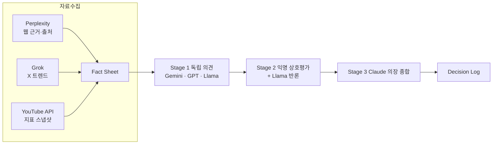

# LLM Council 확장 위원 연결 설계 — Meta·Grok·Perplexity·GPT 외 (v0.1)

> 작성일: 2026-10-08 · 선행 문서: [`01-interview-and-plan.md`](./01-interview-and-plan.md)
>
> **표기 규칙** — 링크 = 출처로 확인한 사실 / 🔎 **[Claude 추론]** = 출처 없는 추론·제안 / ⚠️ **[검증 필요]** = 출처 간 불일치·서드파티 자료만 있음
>
> 가격·무료 한도는 자주 바뀝니다. 아래 수치는 **2026-10-08 조사 시점** 기준이며 대부분 서드파티 집계라 결제 전 공식 페이지 확인이 필요합니다.

---

## 0. 한 줄 결론

🔎 **[Claude 추론]** 위원을 늘릴 때 **OpenRouter 하나를 "공용 관문"으로** 쓰면 Grok·Perplexity·GPT·Llama 등을 **API 키 1개**로 연결할 수 있습니다. 모든 위원을 매번 부르기보다 **"핵심 위원 + 전문 위원(필요할 때 호출)"** 구조로 운영해야 비용과 호출 수가 통제됩니다.

---

## 1. 위원별 연결 경로 비교

### 1.1 Meta (Llama)

| 경로 | 비용 | 확인된 사실 | 비고 |
|---|---|---|---|
| **Meta 공식 Llama API** | ⚠️ 불명확 | 2025-04 LlamaCon에서 **제한적 프리뷰**로 공개, 가격 미공개 ([TechCrunch](https://techcrunch.com/2025/04/29/meta-previews-an-api-for-its-llama-ai-models/)). 2026년 현재 공식 단가 확인 불가 ([Gate.AI](https://gate.ai/blog/llama-3-1-405b-instruct-specs-pricing-api-access-use-cases)), 서비스 종료 주장도 있으나 미확인 ([Spheron](https://www.spheron.network/blog/meta-shut-down-the-llama-api-self-hosting-llama-is-now-offic/)) | 현재로선 비추천 |
| **Meta AI 앱(소비자용)** | 무료 | API로 제공되지 않음 ([Metronome pricing index](https://metronome.com/pricing-index/meta-ai)) | 자동 연결 불가. 브라우저 자동화는 약관 리스크 |
| **Groq (Llama 호스팅)** | 무료 등급 | Llama 3.3 70B 무료 한도 약 1,000회/일·30회/분, Llama 3.1 8B 약 14,400회/일 (출처 간 불일치 ⚠️). 한도는 API 키별이 아니라 **계정(조직) 단위** ([eesel](https://eesel.ai/blog/groq-pricing), [OpenRouter 블로그](https://openrouter.ai/blog/tutorials/free-llm-apis-compared/), [LocalAIMaster](https://localaimaster.com/blog/groq-api-free-guide)) | **추천**: 빠르고 무료 |
| **OpenRouter** | 무료/유료 | Meta 모델 제공 ([OpenRouter setup guide](https://cdn.jsdelivr.net/npm/@saibolla/ada@0.1.3/skills/perplexity-search/references/openrouter_setup.md)). `:free` Llama 모델 ID는 시기별로 달라 미확인 ⚠️ ([aitoolsradar](https://aitoolsradar.org/blog/guides/openrouter-free-models-2026/)) | 관문 통일용 |
| **로컬 Ollama** | $0 | 8B급 4bit ≈ 5~6GB 메모리 ([Eastondev](https://eastondev.com/blog/en/posts/ai/20260528-ollama-hardware-guide/)) | 현재 PC에선 느림 → 보조 위원만 (01 문서 2.4) |

### 1.2 Grok (xAI)

| 경로 | 비용 | 확인된 사실 | 비고 |
|---|---|---|---|
| **xAI API 직접** | 유료 | Grok 4.7: 입력 $2 / 출력 $6 (100만 토큰당, 200K 토큰 미만), 200K 초과 시 2배 ([MorphLLM](https://www.morphllm.com/grok-api-pricing), [CostBench](https://costbench.com/software/llm-api-providers/xai-api/)) ⚠️ | **X(트위터) 검색 도구** 사용 가능 |
| ↳ X 검색 도구 | 별도 과금 | 2026-05 기존 Live Search 방식이 폐지되고 `web_search`·`x_search` 에이전트 도구로 전환 ([releases.sh](https://releases.sh/release/rel_riWxs8I6mz0rrI_3ovwp0-ai-sdk-xai-v3-0-93-deprecates-searchparameters-for-agent-tools), [xAI Tools 문서](https://docs.x.ai/docs/tools/overview)). 2026-09-21부터 X 검색이 **게시물 1,000개당 $5** 방식으로 바뀌었다는 보도 ([RuntimeWire](https://runtimewire.com/article/xai-is-changing-the-economics-of-x-search-runtimewire-was-built-for-a-narrower-r)) ⚠️ | 🔎 **트렌드 스카우트 역할**에 적합 |
| ↳ 무료 크레딧 | 조건부 | **데이터 공유에 동의하면 월 $150 크레딧** — 단, API로 보낸 프롬프트가 학습에 쓰일 수 있고 **한 번 켜면 끌 수 없다**는 콘솔 문구 보고 ([agentdeals](https://agentdeals.dev/vendor/xai), [WikiDocs](https://wikidocs.net/381613)) ⚠️ | 민감 정보(채널 전략)는 신중히 |
| **OpenRouter** | 유료 | xAI Grok 모델 제공 ([OpenRouter xAI 페이지](https://openrouter.ai/provider/xai)) | ⚠️ OpenRouter 경유 시 `x_search` 도구 사용 가능 여부 미확인 |

### 1.3 Perplexity (Sonar)

| 경로 | 비용 | 확인된 사실 | 비고 |
|---|---|---|---|
| **Perplexity API (Sonar)** | 유료 | Sonar: 입력·출력 각 $1/100만 토큰 + **검색 요청 수수료**(1,000회당 $5~12, 출처 간 상이 ⚠️). 질문 1건 약 $0.0054 예시 ([Puter](https://developer.puter.com/tutorials/perplexity-api-pricing/), [CostBench](https://costbench.com/software/ai-search-apis/perplexity-sonar-api/)) | 🔎 **웹 근거·출처 제시** → 팩트체커 역할에 적합 |
| ↳ Pro 구독 혜택 | 구독 시 | Perplexity **Pro 구독자는 매월 1일 API 크레딧 $5 지급** ([Perplexity Help](https://hub-prod.perplexity.ai/hub/faq/pplx-api)) | $5 ≈ 약 900회 질문 (위 예시 단가 기준 🔎 계산) |
| ↳ 주의 | — | Sonar Chat Completions 엔드포인트가 2026-09-27까지 지원 후 Agent API로 이전한다는 보도 ([CloudZero](https://www.cloudzero.com/blog/perplexity-api-pricing/)) ⚠️ | 연결 시 현재 엔드포인트 확인 필수 |
| **OpenRouter** | 유료 | Perplexity 모델 15종 제공, 예: Sonar Reasoning Pro $2/$8 ([OpenRouter Perplexity 페이지](https://openrouter.helicone.ai/perplexity)) | 관문 통일용 |

### 1.4 GPT (OpenAI)

| 경로 | 비용 | 확인된 사실 | 비고 |
|---|---|---|---|
| **Codex CLI + ChatGPT 무료 계정** | $0 | Codex는 Free·Go 포함 ChatGPT 플랜 전반에 포함 ([OpenAI Help](https://help.openai.com/en/articles/11369540-codex-usage-limits)), `codex exec`로 비대화식 실행 ([Codex Non-interactive](https://developers.openai.com/codex/noninteractive)). 무료 한도 수치는 미확인 ⚠️ | 🔎 **1순위 시도**: 비용 0, 공식 경로 |
| **OpenAI API** | 유료 | GPT-5.4-mini: $0.75 / $4.50, GPT-5.4-nano: $0.20 / $1.25 (100만 토큰당) — 서드파티 집계, 공식 페이지 확인 필요 ⚠️ ([MorphLLM](https://morphllm.com/openai-api-pricing), [IntuitionLabs](https://intuitionlabs.ai/articles/chatgpt-api-pricing-2026-token-costs-limits)) | 안정적, 저렴 |
| **gpt-oss-120b (OpenAI 공개 가중치 모델)** | 무료 가능 | 2026-07 OpenRouter 무료 모델 목록에 포함 ([Buldrr](https://buldrr.com/openrouter-free-models-list-2026-all-27-models-ranked-tested/)) ⚠️ 현재 가용 여부 확인 필요 | 🔎 ChatGPT의 최신 GPT와는 **다른 모델**이므로 "GPT 관점" 대표로는 한계 |

### 1.5 그 외 후보 (참고)

| 후보 | 경로 | 비고 |
|---|---|---|
| DeepSeek·Qwen·GLM·Nemotron 등 | OpenRouter `:free` | 무료 목록은 **수시로 바뀜**. 2026-07 기준 약 23~25개 ([aitoolsradar](https://aitoolsradar.org/blog/guides/openrouter-free-models-2026/), [Buldrr](https://buldrr.com/openrouter-free-models-list-2026-all-27-models-ranked-tested/)). DeepSeek은 더 이상 무료가 아니라는 보고도 있음 ⚠️ |
| Mistral 등 | 각사 API / OpenRouter | 필요 시 추가 조사 |

### 1.6 로컬 GPU 대안: Colab·Kaggle로 오픈모델을 돌리면? (2026-10-08 추가 질문)

| 항목 | Google Colab (무료) | Kaggle Notebooks (무료) |
|---|---|---|
| GPU | T4급 약 15GB VRAM, **배정 보장 없음**(혼잡 시 GPU 미배정 가능) ([Hivenet](https://www.hivenet.com/post/google-colaboratory-gpu-complete-guide-to-free-cloud-gpu-access-and-limitations), [Deploybase](https://deploybase.ai/articles/google-colab-fine-tune-llm-free-vs-pro-gpu-comparison)) | P100 16GB 1개 또는 T4 2개(합 32GB) ([GMI Cloud](https://www.gmicloud.ai/en/blog/best-free-gpu-cloud-options-for-ai-startups-and-researchers)) |
| 시간 한도 | 세션 최대 12시간, 유휴 시 종료(유휴 시간 기준은 비공개·출처 상이) ([Hivenet](https://www.hivenet.com/post/google-colaboratory-gpu-complete-guide-to-free-cloud-gpu-access-and-limitations)) | 주당 약 30 GPU시간, 세션 12시간 (9시간이라는 자료도 있음 ⚠️) ([gpuperhour](https://gpuperhour.com/blog/free-cloud-gpus-and-credits), [PyPI kgz](https://pypi.org/p/kgz)) |
| 외부 API 서버로 사용 | **사실상 불가에 가까움**: 무료 세션은 노트북과 무관한 웹 서비스 제공, 프록시, SSH·원격 데스크톱, 노트북 대신 웹 UI 사용 등이 금지 항목으로 알려짐 (공식 FAQ 원문은 직접 확인 못함 ⚠️) ([Colab FAQ](https://research.google.com/colaboratory/faq.html), [Prodigy 포럼 인용](https://support.prodi.gy/t/is-it-possible-to-install-prodigy-on-google-colab-pro/5416/4)). ngrok 같은 터널링 도구 제작자도 Colab 프록시는 Google이 허용하지 않는다고 명시 ([ColabGeek](https://pypi.org/project/ColabGeek)) | 터널링 허용 여부 미확인 ⚠️ |

- 🔎 **[Claude 추론] 결론**: 사양만 보면 T4(15GB)에 14B급 4bit 모델(약 9~10GB)이 들어가므로 **기술적으로는 가능**합니다. 하지만 Council 위원은 PC의 Claude Code가 **언제든 호출할 수 있는 API**여야 하는데,
  1. Colab 무료는 터널링으로 외부에 서버를 여는 방식이 약관 금지 항목에 걸릴 가능성이 높고,
  2. 두 서비스 모두 세션이 12시간 안팎에서 끊기고 GPU 배정도 보장되지 않아 **매일 자동 루틴에 부적합**합니다.
- 🔎 **권장 역할 분담**
  - **Council의 Llama 위원** → Groq 무료 API (설치·서버 불필요, 70B급 사용 가능, 1.1 참고)
  - **Colab·Kaggle** → 노트북 안에서 끝나는 **실험·학습용**: ① 쌓인 Council 로그로 "위원 불일치 vs 성과" 분석 ② 오픈모델 파인튜닝·선호 학습(DPO 등) 실습 ③ 로컬에 못 올리는 14B~32B 모델의 품질 비교 벤치마크. 이는 AIGEN(GDPO·SFT) 경험·AIFFEL 과정과도 직결됩니다.

---

## 2. 공용 관문: OpenRouter

- 하나의 계정·키로 Perplexity Sonar, xAI Grok, OpenAI GPT 등 여러 회사 모델 호출 가능 ([ComfyUI OpenRouter 노드 문서](https://docs.comfy.org/zh/built-in-nodes/OpenRouterLLMNode), [OpenRouter setup guide](https://cdn.jsdelivr.net/npm/@saibolla/ada@0.1.3/skills/perplexity-search/references/openrouter_setup.md))
- **BYOK(Bring Your Own Key)**: 각사 키를 OpenRouter에 등록해 쓸 수 있으며, 수수료는 OpenRouter 크레딧에서 차감되고 매월 일정량까지 면제 ([OpenRouter BYOK 문서](https://openrouter.ai/docs/features/byok)). 2024-12 발표 당시 수수료는 원 사용료의 5% ([OpenRouter 발표](https://openrouter.ai/announcements/bring-your-own-api-keys))
- 무료(`:free`) 모델: 분당 20회, 크레딧 구매 $10 미만이면 하루 50회, **$10 이상 구매하면 하루 1,000회** ([OpenRouter Limits](https://openrouter.ai/docs/api-reference/limits))
- 🔎 **[Claude 추론]** **$10 1회 충전**만으로 ① 무료 모델 한도가 하루 1,000회로 늘고 ② 그 크레딧으로 Grok·Perplexity·GPT 유료 호출까지 해결되어, 위원 확장의 **가성비가 가장 좋은 첫 투자**입니다.

---

## 3. 확장 Council 구성안 (🔎 Claude 추론)

### 3.1 역할 기반 배치 — "핵심 위원 + 전문 위원"

| 구분 | 위원 | 연결 경로 | 역할 | 호출 시점 |
|---|---|---|---|---|
| 의장 | **Claude** (Claude Code) | Claude Max | 종합·루브릭 채점 | 매 회의 |
| 핵심 | **Gemini** | Gemini CLI (Google AI Pro) | 전략 위원 | 매 회의 |
| 핵심 | **GPT** | Codex CLI(무료 계정) → 부족하면 OpenRouter/OpenAI API | 전략 위원 | 매 회의 |
| 핵심 | **Llama (Meta)** | Groq 무료 → 대안 OpenRouter | **반론자(Devil's Advocate)**·오픈모델 관점 | 매 회의 |
| 전문 | **Perplexity** | OpenRouter 또는 Sonar API | **팩트체커** — 회의 전 Fact Sheet의 최신 웹 근거·출처 수집 | 데이터 수집 단계 |
| 전문 | **Grok** | xAI API (X 검색 필요 시) / OpenRouter | **트렌드 스카우트** — X(트위터) 실시간 반응·밈 탐지 | 매일 트렌드 루틴 |
| 예비 | DeepSeek·Qwen 등 | OpenRouter `:free` | 위원 결석(한도 초과·모델 중단) 시 대체 | 필요 시 |

### 3.2 위원 수와 호출 수

- 원본 3단계 구조에서 회의 1회 호출 수 = **위원 수 × 2 + 1(의장)** (01 문서 4장 계산 방식)
- 위원 7명 전원 참석 시 **15회 호출**/회의 → 🔎 비용·시간·한도 소모가 커지므로 핵심 4명(의장 포함)이 토론하고 Perplexity·Grok은 **회의 전 자료 수집 담당**으로 분리하면 회의당 **7회 + 자료 수집 2~3회** 수준으로 유지됩니다.

### 3.3 확장 흐름

### 3.4 회의 1회 추가 비용 추정 (🔎 Claude 추론 · 가격은 위 서드파티 수치 기준 ⚠️)

가정: 위원당 Stage1 입력 3K/출력 1.5K + Stage2 입력 8K/출력 1K (합 입력 11K, 출력 2.5K 토큰)

| 위원 | 경로 | 회의 1회 추정 비용 |
|---|---|---|
| Gemini | Gemini CLI (구독) | $0 |
| GPT | Codex CLI 무료 → (대체) GPT-5.4-mini API | $0 → 약 $0.02 |
| Llama | Groq 무료 | $0 |
| Perplexity (자료 수집 1회) | Sonar | 약 $0.005 |
| Grok (자료 수집 1회, 입력 5K/출력 1K 가정) | Grok 4.7 | 약 $0.016 + X 검색 수수료 |
| **합계** |  | **약 $0.02 ~ $0.05 / 회의** |

→ $10 충전 시 대략 **200~500회 회의**분 (추정, 실제 토큰 수에 따라 크게 달라짐)

---

## 4. 주의 사항

| 항목 | 내용 |
|---|---|
| 약관 | 모든 위원은 **공식 API/CLI로만** 연결. 소비자용 웹 화면(Meta AI·Grok 웹·Perplexity 웹·ChatGPT 웹) 자동 조작은 약관 위반 위험 — OpenAI는 명시적으로 금지 ([OpenAI Terms](https://openai.com/policies/terms-of-use/)). 다른 회사 약관은 미확인 ⚠️ |
| 데이터 | xAI 데이터 공유 크레딧은 **되돌릴 수 없는 학습 동의** ([agentdeals](https://agentdeals.dev/vendor/xai)) ⚠️. 🔎 무료 등급 서비스 전반은 입력이 학습·로그에 쓰일 수 있으므로 비공개 전략·개인정보는 Fact Sheet에서 제외 |
| 가용성 | 무료 모델 목록·가격이 자주 바뀜 → `members.yaml`에서 위원을 **설정만으로 교체** 가능하게 설계 (01 문서 3.4) |
| 편향 | 위원이 늘어도 **같은 데이터로 학습된 모델끼리 같은 오류**를 공유할 수 있음 🔎 → 다수결 대신 데이터·루브릭 기반 결론 유지 (01 문서 2.2) |

---

## 5. 연결 순서 제안 (🔎 Claude 추론)

| 순서 | 작업 | 비용 |
|---|---|---|
| 1 | Codex CLI 설치 → ChatGPT 무료 계정 로그인 → `codex exec` 동작·한도 확인 (**GPT**) | $0 |
| 2 | Groq 계정·API 키 발급 → Llama 3.3 70B 호출 테스트 (**Meta**) | $0 |
| 3 | OpenRouter 가입 → **$10 1회 충전** → Perplexity Sonar·Grok 호출 테스트 (**Perplexity·Grok**) + 무료 모델 1,000회/일 확보 | $10 |
| 4 | (선택) X 실시간 트렌드가 중요하면 xAI API 직접 연결해 `x_search` 테스트 | 사용량 비례 |
| 5 | (선택) Perplexity Pro 구독 중이거나 구독할 계획이면 월 $5 API 크레딧 활용 | 구독료 |

---

## 6. 출처 목록

- OpenRouter Limits — https://openrouter.ai/docs/api-reference/limits
- OpenRouter BYOK — https://openrouter.ai/docs/features/byok , https://openrouter.ai/announcements/bring-your-own-api-keys
- OpenRouter xAI 페이지 — https://openrouter.ai/provider/xai
- OpenRouter Perplexity 페이지(미러) — https://openrouter.helicone.ai/perplexity
- OpenRouter 블로그: Free LLM APIs Compared — https://openrouter.ai/blog/tutorials/free-llm-apis-compared/
- ComfyUI OpenRouter 노드 — https://docs.comfy.org/zh/built-in-nodes/OpenRouterLLMNode
- OpenRouter setup guide — https://cdn.jsdelivr.net/npm/@saibolla/ada@0.1.3/skills/perplexity-search/references/openrouter_setup.md
- OpenRouter 무료 모델 2026 — https://aitoolsradar.org/blog/guides/openrouter-free-models-2026/ , https://buldrr.com/openrouter-free-models-list-2026-all-27-models-ranked-tested/
- TechCrunch (Llama API 프리뷰) — https://techcrunch.com/2025/04/29/meta-previews-an-api-for-its-llama-ai-models/
- Gate.AI (Llama 가격) — https://gate.ai/blog/llama-3-1-405b-instruct-specs-pricing-api-access-use-cases
- Spheron (Llama API 종료 주장) — https://www.spheron.network/blog/meta-shut-down-the-llama-api-self-hosting-llama-is-now-offic/
- Metronome (Meta AI) — https://metronome.com/pricing-index/meta-ai
- Groq 무료 등급 — https://eesel.ai/blog/groq-pricing , https://localaimaster.com/blog/groq-api-free-guide
- xAI 가격 — https://www.morphllm.com/grok-api-pricing , https://costbench.com/software/llm-api-providers/xai-api/
- xAI 도구 — https://docs.x.ai/docs/tools/overview , https://releases.sh/release/rel_riWxs8I6mz0rrI_3ovwp0-ai-sdk-xai-v3-0-93-deprecates-searchparameters-for-agent-tools
- X 검색 과금 변경 — https://runtimewire.com/article/xai-is-changing-the-economics-of-x-search-runtimewire-was-built-for-a-narrower-r
- xAI 무료 크레딧 — https://agentdeals.dev/vendor/xai , https://wikidocs.net/381613
- Perplexity 가격 — https://developer.puter.com/tutorials/perplexity-api-pricing/ , https://costbench.com/software/ai-search-apis/perplexity-sonar-api/ , https://www.cloudzero.com/blog/perplexity-api-pricing/
- Perplexity Pro API 크레딧 — https://hub-prod.perplexity.ai/hub/faq/pplx-api
- OpenAI Codex — https://help.openai.com/en/articles/11369540-codex-usage-limits , https://developers.openai.com/codex/noninteractive
- OpenAI API 가격(서드파티) — https://morphllm.com/openai-api-pricing , https://intuitionlabs.ai/articles/chatgpt-api-pricing-2026-token-costs-limits
- OpenAI Terms of Use — https://openai.com/policies/terms-of-use/
- Eastondev Ollama 하드웨어 — https://eastondev.com/blog/en/posts/ai/20260528-ollama-hardware-guide/
- Colab FAQ(공식) — https://research.google.com/colaboratory/faq.html , Prodigy 포럼 인용 — https://support.prodi.gy/t/is-it-possible-to-install-prodigy-on-google-colab-pro/5416/4 , ColabGeek — https://pypi.org/project/ColabGeek
- Colab 무료 GPU — https://www.hivenet.com/post/google-colaboratory-gpu-complete-guide-to-free-cloud-gpu-access-and-limitations , https://deploybase.ai/articles/google-colab-fine-tune-llm-free-vs-pro-gpu-comparison
- Kaggle 무료 GPU — https://gpuperhour.com/blog/free-cloud-gpus-and-credits , https://pypi.org/p/kgz , https://www.gmicloud.ai/en/blog/best-free-gpu-cloud-options-for-ai-startups-and-researchers
